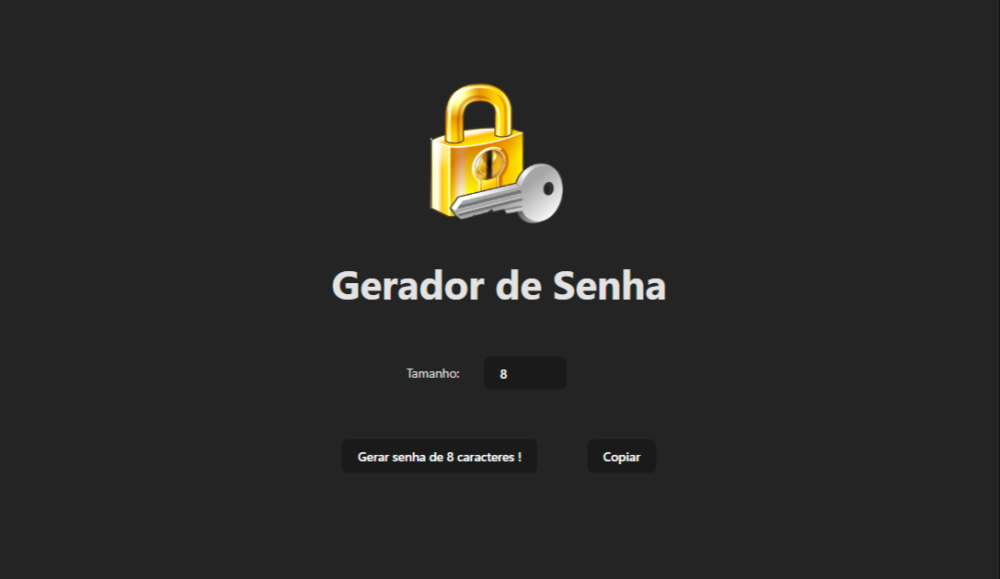
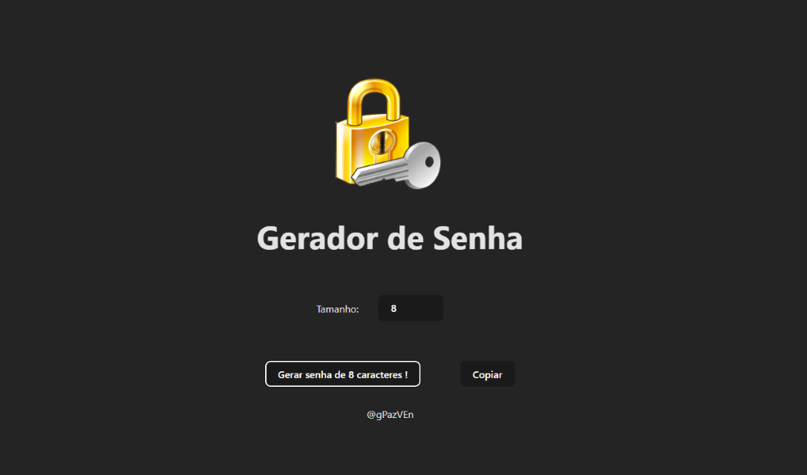

# GERADOR DE SENHA



## Descrição 
Um gerador de Passwords, contendo (Letras Maiusculas, Minusculas, Números, Caracteres especiais), o tamanho é definido pelo usuário, limitando ao máximo 20 caracteres.

### Objetivo 

Tem como objetivo, auxiliar na criação de senhas aleatórias quando o usuário está indeciso sobre qual senha utilizar, podendo ser implementado em telas de cadastros ou em outras utilidades.

## Demostração do Layout 



## Como Utilizar 

1. **Clone o Repositório**

```bash
 git clone ENDEREÇO REPOSITÓRIO
```
2. **Rodar**
- Entrar na pasta raiz utilizando terminal !
```bash
cd PASTA

 npm run dev
```


## Tecnologias Utilizadas 

1.JavaScript 

2.Cascading Style Sheets (CSS) 

3.React 

## Autor

[Abreeu](https://www.linkedin.com/in/abreeu/)


## Licença

Este projeto está sob a licença MIT. Você é livre para usá-lo como quiser, tanto para uso pessoal quanto comercial.


